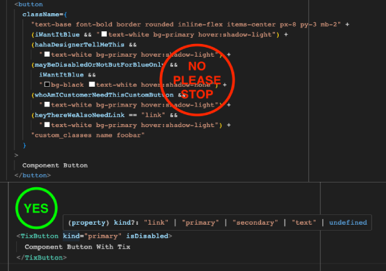

# tix

[](https://www.npmjs.com/package/styled-tix?activeTab=readme)
[](https://www.npmjs.com/package/styled-tix?activeTab=readme)
[](https://bundlephobia.com/package/styled-tix@latest)
[](https://github.com/danhtran94/styled-tix/blob/main/LICENSE)

Styles your React components with TailwindCSS classes, and define variant properties without fighting huge & long classnames.



## Preview Simple Usecase
This is simple sample for **`styles button html tag`**. `tix` can do more complex cases than below.

Playground click below: \
[](https://codesandbox.io/p/sandbox/styled-tix-sample-3789lk)

```jsx
/**
 * First, create our Button Component with tix.
 * file: TixButton.tsx
 */
import { tix, tw } from "./tix"; // Please read the document `Configuration`

export const TixButton = tix({
  base: tw`text-base font-bold border rounded inline-flex items-center px-8 py-3`,
  variants: {
    // variant can be object
    kind: {
      primary: tw`text-white bg-primary 
        hover:shadow-light`,
      secondary: tw`text-secondary border-secondary bg-light 
        hover:bg-neutral-200`,
      text: tw`text-sm font-semibold text-neutral-400 border-none bg-none rounded-none px-0
        hover:text-primary`,
      link: tw`text-primary border-b-2 border-transparent rounded-none px-0 py-0 pb-1
        hover:border-b-2 hover:border-b-primary`
    },
    // variant can be string
    noPadding: tw`p-0`,
    // variant can be function
    isDisabled: (disabled: boolean, stylesOf) => {
      const { kind, noPadding } = stylesOf(TixButton); // get other variant's values
      
      if (disabled && kind === "primary") {
        return tw`bg-gray hover:shadow-none`;
      }

      // any styling logic...

      return tw``;
    }
  },
  defaults: { // `defaults` has full support typescript base on `variants` type.
    kind: "primary", // keyof `kind` obj => "primary" | "secondary" | "text" | "link"
    noPadding: false, // string => true | false
    isDisabled: false // `disabled` type declaration = boolean in func `isDisabled` => true | false
  }
}, /* Element to applying styles */ "button" /* Element extends ElementType */)


/**
 * Later, use created `TixButton` in `App` or anywhere you want.
 * file: App.tsx
 */
import React, { FC } from "react";
import { TixButton } from "./TixButton"
 
const App: FC = () => {
  const handleHelloTix = () => { alert("Hello Tix!"); };

  return (<div>
    <TixButton onClick={handleHelloTix}>Default TixButton binds actions</TixButton> 
    {/* supports full ts for button's proptypes. */}
    {/* no need to re-declare anything like: onClick, onMouseXYZ, etc... */}

    <TixButton kind="text">Text TixButton</TixButton>
    <TixButton kind="primary" noPadding>Primary TixButton no Padding</TixButton>    
    <TixButton kind="primary" isDisabled>Disabled Primary TixButton</TixButton>

    <TixButton as={"a"} kind="link" href="https://google.com">Link TixButton to Google</TixButton> 
    {/* any TixComponent supports Polymorphic + forwardRef by default. */}
    {/* you can change under element by passing it "as" prop.  */}
    {/* tix's typescript will override default one then suggests correct proptypes. */}
  </div>)
}
```

## Features

**Extends Component & Custom Props**
```jsx
/**
 * First, create our extended TixButton with User's Props.
 * file: TixButtonCustomProps.tsx
 */
import { useState, useEffect } from "react";
import { tix, withProps, tw } from "./tix"; // Please read the document `Configuration`
import { TixButton } from "./TixButton";

// Define CustomProps type
interface CustomProps {
  initCount: number;
  onChangeCount: (val: number) => void;
}

// Declare CustomProps using `withProps` helper
export const TixButtonCustomProps = withProps<CustomProps>(tix)(
  {
    name: "ButtonCustomProps",
    base: TixButton.config.base,
    variants: {
      ...TixButton.config.variants, // copy variants from TixButton
      kind: {
        primary: tw`bg-red-500 text-white`, // override primary styles
      },
    },
    defaults: TixButton.config.defaults
  },
  TixButton, // default under element as TixButton
  (styled) => (_props, ref) => {
    const [El, { initCount, onChangeCount, ...props }] = styled(_props);
    const [count, setCount] = useState(initCount); // get custom prop value

    useEffect(() => {
      count && onChangeCount(count);
    }, [count, onChangeCount]);

    return <El {...props} onClick={() => setCount(count + 1)} />;
  }
);

/** 
 * file: App.tsx
 */
import React, { FC } from "react";
import { TixButtonWithProps } from "./TixButtonWithProps"
 
const App: FC = () => {  
  return (<div>
    <TixButtonCustomProps
      kind="primary"
      initCount={0}
      onChangeCount={(num) => alert(num)}
    >
      CustomProps counting increment
    </TixButtonCustomProps>
  </div>)
}
```
**Polymorphic Component & Refs/useRef**

**Sample use tix with react-aria**
```jsx
/**
 * file: TixButtonA11Y.tsx
 */
import { useRef } from "react";

import { useButton, AriaButtonProps } from "react-aria"; // Import "react-aria"

import { tix, withProps, xrefs, compareAsEl, propsOf } from "./tix";
import { TixButton } from "./TixButton";

// Declare aria's AriaButtonProps using `withProps` helper
export const TixButtonA11Y = withProps<AriaButtonProps>(tix)(
  {
    name: "TixButtonA11Y",
    variants: {},
  },
  TixButton, // reuse TixButton
  (styled) => (_props, ref) => {
    const [El, props] = styled(_props);

    // useButton by react-aria
    const ariaRef = useRef<HTMLButtonElement | null>(null);
    const { buttonProps, isPressed } = useButton(props, ariaRef);

    // Polymorpic check 'as' prop value and casts El type
    const [AsA, refA] = compareAsEl("a", El, ref);
    // If as = 'a' == true, do something...
    if (AsA) {
      console.warn(
        "This component may not working correct with prop 'as' = 'a'."
      );
      return (
        <AsA ref={refA} {...propsOf("a", props)}>
          This component may not working with prop 'as' = 'a'.
        </AsA>
      );
    }

    // Return El with combined refs with tix xrefs helper
    return (
      <El
        ref={xrefs<"button">([ref, ariaRef])}
        {...{ ...props, ...buttonProps }}
      ></El>
    );
  }
);


/** 
 * file: App.tsx
 */
import React, { FC } from "react";
import { TixButtonWithProps } from "./TixButtonWithProps"
 
const App: FC = () => {
  const handleHelloTix = () => { alert("Hello Tix!"); };

  return (<div>
    <TixButtonA11Y kind="primary" onPress={handleHelloTix}>
      This button use aria's onPress instead onClick
    </TixButtonA11Y>
    <TixButtonA11Y as={"a"}></TixButtonA11Y>
  </div>)
}
```

**Sample use tix to define generic items type & overrides props**
```jsx
import React from "react";
import * as nui from "@nextui-org/react";

import { tix, tw, withProps, xrefs, PolymorphicTixProps, PropsOverrides } from "@/libs/tix";
import { Overrides } from "@/libs/types";

interface Item {
  id: number;
  text: string;
}

export interface AutocompleteProps<T extends Item = any> {
  items: T[];
  renderItem: (item: T) => React.ReactNode;
  children?: never;
}

const AutocompleteInner = withProps<AutocompleteProps<Item>>(tix)(
  {
    name: "Autocomplete",
    base: tw`rounded-2xl bg-white font-inter`,
    variants: {},
  },
  nui.Autocomplete,
  (styled) => (props, ref) => {
    const [, { items, renderItem, ...rest }] = styled(props);

    return (
      <nui.Autocomplete variant="bordered" {...rest} ref={xrefs([ref])}>
        {items.map((item) => (
          <nui.AutocompleteItem
            className="min-h-4 min-w-4 font-inter"
            key={item.id}
            value={item.id}
            textValue={item.text}
          >
            {renderItem(item)}
          </nui.AutocompleteItem>
        ))}
      </nui.Autocomplete>
    );
  }
);

export const Autocomplete: <T extends Item>(
  props: PropsOverrides<
    PolymorphicTixProps<typeof AutocompleteInner>,
    AutocompleteProps<T>
  >
) => ReturnType<typeof AutocompleteInner> = AutocompleteInner;
```

## Installation
`yarn add styled-tix tailwind-merge`

**(Important)** For using with `tailwindcss`, please install it first: \
https://tailwindcss.com/docs/installation

**(Optional)** If you don't use tailwindcss no need to install `tailwind-merge`. \
`styled-tix` can work alone without any dependencies.


## Configuration
Create a `tix.ts` file inside your `src` folder.

**`tix.ts`**
```typescript
import { newTix } from "styled-tix";
import { twMerge } from "tailwind-merge";

export * from "styled-tix";
export const tix = newTix(twMerge); 
// You can use any classes mixer you want.
// here we will use `tailwind-merge` for tailwindcss
```

## VSCode IntelliSense
### TailwindCSS

Install `Tailwind CSS IntelliSense` from VSCode. \
Add this line to your VSCode config settings, open by pressing <kbd>⌘</kbd> + <kbd>,</kbd>.
```json
"tailwindCSS.experimental.classRegex": [    
  "tw`([^`]*)"
]
```


## References
// https://stackoverflow.com/questions/58469229/react-with-typescript-generics-while-using-react-forwardref/58473012
// https://www.tsteele.dev/posts/react-polymorphic-forwardref